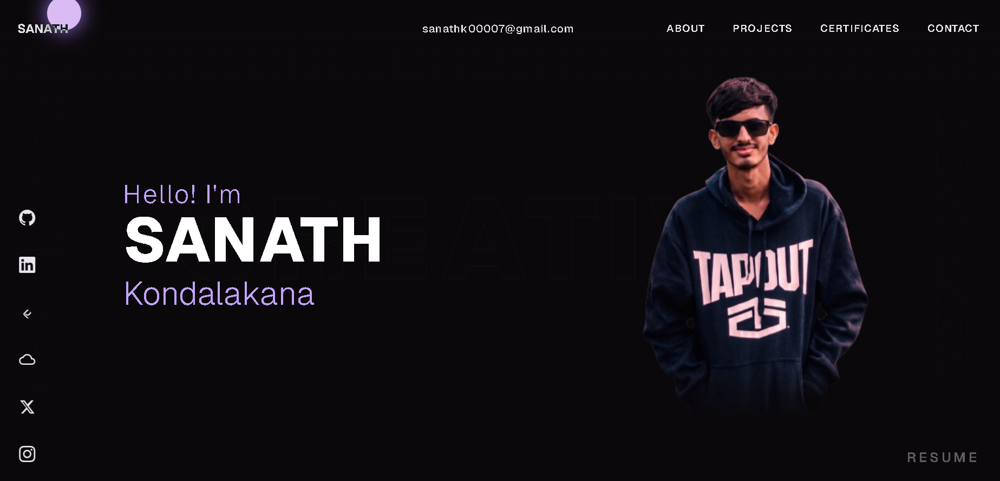
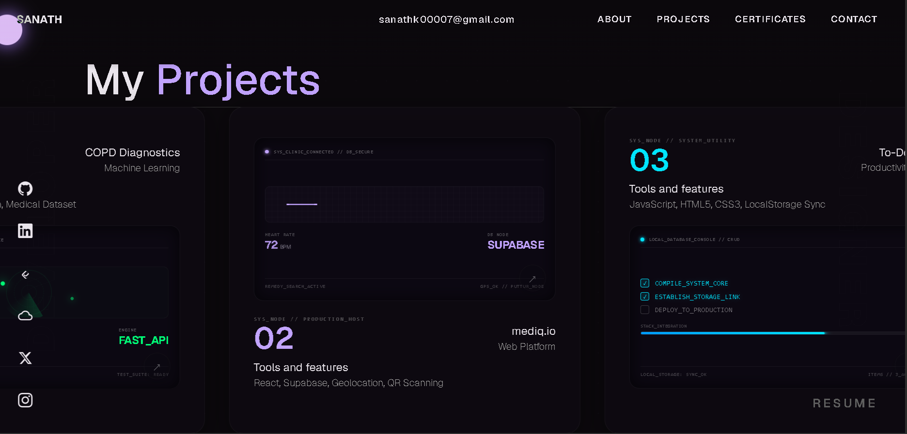
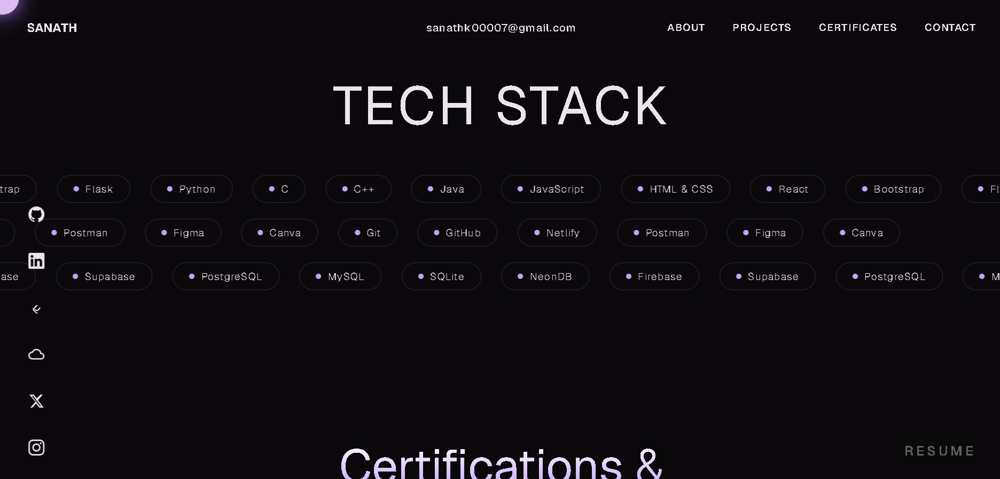
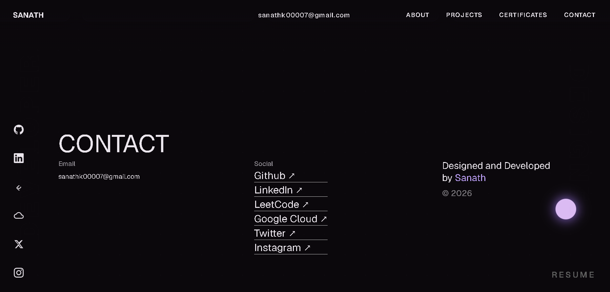

# Personal Portfolio Website (Task 1)

A dark, futuristic personal portfolio website showcasing academic background, projects, skills, and certifications, with custom GSAP-powered scroll animations.

**Live demo:** https://sanath00007.github.io/synent-task1-portfolio-sanathk/

---

## Objective

Design and build a single-page personal portfolio website with a distinctive dark/futuristic visual identity, presenting academic background, projects, technical skills, and achievements, while incorporating advanced scroll-based animation techniques to create a polished, professional presentation.

## Steps Performed

1. Defined the visual identity — a dark, futuristic color palette and typography system.
2. Structured the single-page layout: hero/intro, about, projects, skills, certificates, and contact sections.
3. Built the semantic HTML structure (`index.html`) and component styling (`style.css`).
4. Implemented custom interactive details: an animated CSS cursor and a blob-style loading screen animation.
5. Added scroll-driven motion using GSAP and the ScrollTrigger plugin — including a character-by-character blur-fade text reveal and a horizontally pinned scroll section.
6. Added a certificates section referencing achievements (e.g. competition participation) backed by a `certificates/` folder of supporting files.
7. Made the layout responsive across screen sizes and tested animation performance across browsers.
8. Deployed the site via GitHub Pages and documented the project.

## Tools Used

| Category | Tools / Technologies |
|---|---|
| Markup & Styling | HTML5, CSS3 |
| Logic & Animation | Vanilla JavaScript (ES6), GSAP, GSAP ScrollTrigger plugin |
| Version Control / Hosting | Git, GitHub, GitHub Pages |

## Outcome

A fully responsive, animated personal portfolio site live on GitHub Pages, presenting projects, skills, and certifications with a distinctive dark/futuristic aesthetic and smooth scroll-driven interactions — meeting all Task 1 deliverables.

---

## Sections

| Section | Description |
|---|---|
| Hero | Animated intro with blur-fade text reveal |
| About | Academic background and summary |
| Projects | Highlighted personal/academic projects |
| Skills | Technical skills overview |
| Certificates | Competition/achievement certificates (see `certificates/`) |
| Contact | Ways to get in touch |

## File Structure

```
.
├── index.html         # Page markup / structure
├── style.css           # Styling, dark theme, layout
├── script.js             # GSAP animations, cursor, loading screen, interactivity
├── img.png                # Site image asset
├── certificates/            # Certificate files referenced on the site
├── screenshots/               # Site screenshots (see below)
└── reports/                     # Brief write-up / task report (see below)
```

## Getting Started

No installation or build tools required.

1. Download/clone the repository.
2. Open `index.html` in any modern web browser.

## Key Features

- Dark, futuristic visual theme with custom typography
- Character-level blur-fade text reveal animation (GSAP)
- ScrollTrigger-powered horizontally pinned scroll section
- Custom animated CSS cursor
- Animated blob-style loading screen
- Certificates section showcasing competition/academic achievements
- Fully responsive across desktop and mobile

## Screenshots
> 
> 
> 
> 


## Browser Support

Works in all modern evergreen browsers (Chrome, Edge, Firefox, Safari) with support for CSS custom properties and modern JS.

## License

Free to use, modify, and distribute for personal or academic projects.
